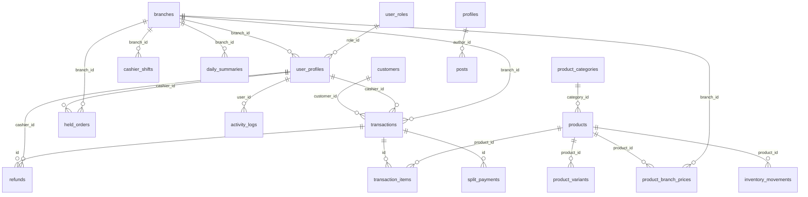

# 🗄️ DATABASE DETAILS — DHBH POS

> **Sumber data:** Live query ke Supabase via Management API (PostgREST / SQL) — *project `jiunlvlcwsntjbyybszd`*
> **Tanggal ekstraksi:** 2026-08-14 · **Update terakhir:** 2026-08-15 (kolom `daily_summaries.total_transfer` + fungsi `generate_daily_summary` ditulis ulang) · **Status project:** `ACTIVE_HEALTHY`
> **Dokumen ini adalah referensi skema database AKTUAL** di Supabase (bukan inferensi dari kode).
> **Android Branch:** 2026-08-15 — Optimasi untuk tablet Android (2GB RAM, 1280x800) tidak memerlukan perubahan database.

---

## 1. 📋 Informasi Project Supabase

| Atribut | Nilai |
|---|---|
| **Project ID / Ref** | `jiunlvlcwsntjbyybszd` |
| **Nama Project** | `Mako-Replicate` |
| **Region** | `ap-southeast-2` (Sydney) |
| **Status** | `ACTIVE_HEALTHY` |
| **Organization ID** | `llqbsdoyxuzaufvvupox` |
| **URL REST API** | `https://jiunlvlcwsntjbyybszd.supabase.co/rest/v1/` |
| **Database host** | `db.jiunlvlcwsntjbyybszd.supabase.co` |
| **App (Flutter)** | `dhbh_app` — POS multi-cabang klinik kesehatan |

> ⚠️ **Tidak ada Postgres ENUM type** di schema `public`. Kolom status/payment/print semuanya bertipe **`text`** (lihat §6).

---

## 2. 📂 Ringkasan Skema (20 Tabel + 1 View)



### 2.1 Daftar Tabel & Jumlah Baris (COUNT aktual)

| # | Tabel | Baris | Keterangan |
|---|---|---|---|
| 1 | `activity_logs` | 54 | Log aktivitas (transaksi & refund baru) |
| 2 | `branches` | 2 | Cabang klinik (DHBH Kranggan & DHBH Cikampek) |
| 3 | `cashier_shifts` | 0 | Shift kasir (belum terpakai) |
| 4 | `customers` | 1 | Data pelanggan |
| 5 | `daily_summaries` | 2 | Ringkasan penjualan harian per cabang — diisi app on-demand via RPC `generate_daily_summary`; 1 baris per cabang per tanggal (zero-fill) |
| 6 | `held_orders` | 3 | Pesanan ditahan / parkir |
| 7 | `inventory_movements` | 0 | Pergerakan stok (belum terpakai) |
| 8 | `posts` | 1 | Artikel/berita (blog website) |
| 9 | `product_branch_prices` | 2 | Harga khusus per cabang |
| 10 | `product_categories` | 4 | Kategori produk |
| 11 | `product_variants` | 0 | Varian produk (belum terpakai) |
| 12 | `products` | 24 | Master produk/layanan |
| 13 | `products_website` | 1 | Produk untuk website |
| 14 | `profiles` | 22 | Profil user (auth trigger) |
| 15 | `refunds` | 1 | Catatan refund |
| 16 | `split_payments` | 0 | Pembayaran terbagi (belum terpakai) |
| 17 | `transaction_items` | 72 | Item detail transaksi |
| 18 | `transactions` | 18 | Transaksi penjualan |
| 19 | `user_profiles` | 22 | Profil user POS (20 karyawan + admin + kasir) |
| 20 | `user_roles` | 3 | Role pengguna |

**View:** `products_sold_per_day` — agregasi produk terjual per hari (lihat §4).

---

## 3. 🧱 Struktur Tabel Per Kolom

> Tipe data dalam notasi Postgres. Default & nullable mengikuti skema aktual.

### 3.1 `activity_logs` — Log Aktivitas
| Kolom | Tipe | Null | Default | Keterangan |
|---|---|---|---|---|
| `id` | bigint | NO | `nextval(...)` | PK |
| `user_id` | uuid | YES | — | FK → `user_profiles.id` |
| `action` | text | NO | — | aksi (mis. `transaksi_baru`, `refund_baru`) |
| `details` | jsonb | YES | — | detail JSON |
| `ip_address` | text | YES | — | IP user |
| `created_at` | timestamptz | YES | `now()` | waktu log |

### 3.2 `branches` — Cabang
| Kolom | Tipe | Null | Default | Keterangan |
|---|---|---|---|---|
| `id` | bigint | NO | `nextval(...)` | PK |
| `name` | text | NO | — | nama cabang |
| `address` | text | YES | — | alamat |
| `phone` | text | YES | — | telepon |
| `is_active` | boolean | YES | `true` | aktif |
| `created_at` | timestamptz | YES | `now()` | |
| `updated_at` | timestamptz | YES | `now()` | |
| `gmaps_url` | text | YES | — | link Google Maps |
| `whatsapp_number` | text | YES | — | nomor WA |

### 3.3 `cashier_shifts` — Shift Kasir
| Kolom | Tipe | Null | Default | Keterangan |
|---|---|---|---|---|
| `id` | bigint | NO | `nextval(...)` | PK |
| `cashier_id` | uuid | YES | — | FK → `auth.users` (via `user_profiles`) |
| `branch_id` | bigint | YES | — | FK → `branches.id` |
| `modal_awal` | integer | YES | `0` | modal awal |
| `waktu_buka` | timestamptz | YES | — | jam buka shift |
| `waktu_tutup` | timestamptz | YES | — | jam tutup shift |
| `tanggal` | date | YES | `CURRENT_DATE` | tanggal shift |
| `created_at` | timestamptz | YES | `now()` | |
| `updated_at` | timestamptz | YES | `now()` | |

### 3.4 `customers` — Pelanggan
| Kolom | Tipe | Null | Default | Keterangan |
|---|---|---|---|---|
| `id` | bigint | NO | `nextval(...)` | PK |
| `name` | text | NO | — | nama |
| `phone` | text | YES | — | telepon |
| `address` | text | YES | — | alamat |
| `total_visits` | integer | YES | `0` | jumlah kunjungan |
| `total_spent` | bigint | YES | `0` | total belanja |
| `created_at` | timestamptz | YES | `now()` | |
| `updated_at` | timestamptz | YES | `now()` | |

### 3.5 `daily_summaries` — Ringkasan Harian
| Kolom | Tipe | Null | Default | Keterangan |
|---|---|---|---|---|
| `id` | bigint | NO | `nextval(...)` | PK |
| `branch_id` | bigint | YES | — | FK → `branches.id` |
| `date` | date | NO | — | tanggal (UNIQUE dgn branch_id) |
| `total_transactions` | integer | YES | `0` | jumlah transaksi |
| `total_revenue` | bigint | YES | `0` | total pendapatan |
| `total_cash` | bigint | YES | `0` | total tunai |
| `total_debit` | bigint | YES | `0` | total debit |
| `total_credit` | bigint | YES | `0` | total kredit |
| `total_qris` | bigint | YES | `0` | total QRIS |
| `total_transfer` | bigint | YES | `0` | total Transfer (ditambahkan 2026-08-15) |
| `total_e_wallet` | bigint | YES | `0` | total e-wallet |
| `total_refunds` | bigint | YES | `0` | total refund |
| `created_at` | timestamptz | YES | `now()` | |
| `updated_at` | timestamptz | YES | `now()` | |

🔒 **UNIQUE:** `(branch_id, date)`

### 3.6 `held_orders` — Pesanan Ditahan
| Kolom | Tipe | Null | Default | Keterangan |
|---|---|---|---|---|
| `id` | bigint | NO | `nextval(...)` | PK |
| `branch_id` | bigint | YES | — | FK → `branches.id` |
| `cashier_id` | uuid | YES | — | FK → `user_profiles.id` |
| `items` | jsonb | NO | — | item keranjang (JSON) |
| `notes` | text | YES | — | catatan |
| `created_at` | timestamptz | YES | `now()` | |
| `updated_at` | timestamptz | YES | `now()` | |
| `customer_name` | text | YES | — | nama pelanggan |
| `customers` | jsonb | NO | `'[]'::jsonb` | array nama pelanggan (multi — 2026-08-15) |
| `hold_order_status` | text | NO | `'active'` | status (active → completed) |

### 3.7 `inventory_movements` — Pergerakan Stok
| Kolom | Tipe | Null | Default | Keterangan |
|---|---|---|---|---|
| `id` | bigint | NO | `nextval(...)` | PK |
| `product_id` | bigint | YES | — | FK → `products.id` |
| `quantity_change` | integer | NO | — | perubahan qty |
| `movement_type` | text | NO | — | tipe (text) |
| `reference_id` | bigint | YES | — | ref dokumen |
| `notes` | text | YES | — | catatan |
| `created_at` | timestamptz | YES | `now()` | |

### 3.8 `posts` — Artikel/Blog
| Kolom | Tipe | Null | Default | Keterangan |
|---|---|---|---|---|
| `id` | uuid | NO | `gen_random_uuid()` | PK |
| `title` | text | NO | — | judul |
| `slug` | text | NO | — | slug (UNIQUE) |
| `content` | text | NO | `''` | isi artikel |
| `cover_image` | text | YES | — | gambar sampul |
| `is_published` | boolean | NO | `false` | status terbit |
| `author_id` | uuid | NO | — | FK → `profiles.id` |
| `created_at` | timestamptz | NO | `now()` | |

### 3.9 `product_branch_prices` — Harga Per Cabang
| Kolom | Tipe | Null | Default | Keterangan |
|---|---|---|---|---|
| `id` | bigint | NO | `nextval(...)` | PK |
| `product_id` | bigint | NO | — | FK → `products.id` |
| `branch_id` | bigint | NO | — | FK → `branches.id` |
| `price_clinic` | integer | YES | — | harga klinik override |
| `price_home_visit` | integer | YES | — | harga home visit override |
| `created_at` | timestamptz | YES | `now()` | |
| `updated_at` | timestamptz | YES | `now()` | |

🔒 **UNIQUE:** `(product_id, branch_id)`

### 3.10 `product_categories` — Kategori Produk
| Kolom | Tipe | Null | Default | Keterangan |
|---|---|---|---|---|
| `id` | bigint | NO | `nextval(...)` | PK |
| `name` | text | NO | — | nama kategori (UNIQUE) |
| `description` | text | YES | — | deskripsi |
| `is_active` | boolean | YES | `true` | aktif |
| `created_at` | timestamptz | YES | `now()` | |
| `updated_at` | timestamptz | YES | `now()` | |

### 3.11 `product_variants` — Varian Produk
| Kolom | Tipe | Null | Default | Keterangan |
|---|---|---|---|---|
| `id` | bigint | NO | `nextval(...)` | PK |
| `product_id` | bigint | YES | — | FK → `products.id` |
| `name` | text | NO | — | nama varian |
| `price_adjustment` | integer | YES | `0` | selisih harga |
| `stock` | integer | YES | `0` | stok |
| `is_active` | boolean | YES | `true` | aktif |
| `created_at` | timestamptz | YES | `now()` | |
| `updated_at` | timestamptz | YES | `now()` | |

### 3.12 `products` — Master Produk ⭐
| Kolom | Tipe | Null | Default | Keterangan |
|---|---|---|---|---|
| `id` | bigint | NO | `nextval(...)` | PK |
| `item_no` | integer | YES | — | nomor item (UNIQUE) |
| `category_id` | bigint | YES | — | FK → `product_categories.id` |
| `category` | text | YES | — | nama kategori (denormalisasi) |
| `name` | text | NO | — | nama produk |
| `description` | text | YES | — | deskripsi |
| `price_clinic` | integer | NO | — | harga klinik |
| `price_home_visit` | integer | YES | — | harga home visit |
| `image_url` | text | YES | — | URL gambar |
| `is_active` | boolean | YES | `true` | aktif |
| `created_at` | timestamptz | YES | `now()` | |
| `updated_at` | timestamptz | YES | `now()` | |
| `shopee_url` | text | YES | — | link Shopee |
| `price_website` | integer | YES | — | harga website |

### 3.13 `products_website` — Produk Website
| Kolom | Tipe | Null | Default | Keterangan |
|---|---|---|---|---|
| `id` | uuid | NO | `gen_random_uuid()` | PK |
| `name` | text | NO | — | nama |
| `description` | text | YES | — | deskripsi |
| `image_url` | text | YES | — | gambar |
| `shopee_url` | text | YES | — | link Shopee |
| `price` | numeric | YES | — | harga (numeric) |
| `is_available` | boolean | NO | `true` | tersedia |

### 3.14 `profiles` — Profil Auth User
| Kolom | Tipe | Null | Default | Keterangan |
|---|---|---|---|---|
| `id` | uuid | NO | — | PK, FK → `auth.users.id` |
| `full_name` | text | YES | — | nama lengkap |
| `role` | text | NO | `'admin'` | role (admin/superadmin) |
| `created_at` | timestamptz | NO | `now()` | |

> Diisi otomatis oleh trigger `handle_new_user` (SECURITY DEFINER) saat user baru daftar di Supabase Auth.

### 3.15 `refunds` — Refund
| Kolom | Tipe | Null | Default | Keterangan |
|---|---|---|---|---|
| `id` | bigint | NO | `nextval(...)` | PK |
| `transaction_id` | bigint | YES | — | FK → `transactions.id` |
| `cashier_id` | uuid | YES | — | FK → `user_profiles.id` |
| `reason` | text | NO | — | alasan |
| `refund_amount` | integer | NO | — | jumlah refund |
| `refund_method` | text | NO | — | metode refund |
| `created_at` | timestamptz | YES | `now()` | |

### 3.16 `split_payments` — Pembayaran Terbagi
| Kolom | Tipe | Null | Default | Keterangan |
|---|---|---|---|---|
| `id` | bigint | NO | `nextval(...)` | PK |
| `transaction_id` | bigint | YES | — | FK → `transactions.id` |
| `payment_method` | text | NO | — | metode |
| `amount` | integer | NO | — | nominal |
| `created_at` | timestamptz | YES | `now()` | |

### 3.17 `transaction_items` — Item Transaksi ⭐
| Kolom | Tipe | Null | Default | Keterangan |
|---|---|---|---|---|
| `id` | bigint | NO | `nextval(...)` | PK |
| `transaction_id` | bigint | YES | — | FK → `transactions.id` |
| `product_id` | bigint | YES | — | FK → `products.id` |
| `product_name` | text | NO | — | snapshot nama produk |
| `quantity` | integer | NO | — | jumlah |
| `unit_price` | integer | NO | — | snapshot harga satuan |
| `total_price` | integer | NO | — | total per item |
| `is_home_visit` | boolean | YES | `false` | layanan home visit |
| `notes` | text | YES | — | catatan |
| `created_at` | timestamptz | YES | `now()` | |

### 3.18 `transactions` — Transaksi ⭐
| Kolom | Tipe | Null | Default | Keterangan |
|---|---|---|---|---|
| `id` | bigint | NO | `nextval(...)` | PK |
| `order_no` | integer | NO | — | nomor urut transaksi |
| `branch_id` | bigint | YES | — | FK → `branches.id` |
| `cashier_id` | uuid | YES | — | FK → `user_profiles.id` |
| `customer_id` | bigint | YES | — | FK → `customers.id` |
| `customer_name` | text | YES | — | nama pelanggan |
| `customers` | jsonb | NO | `'[]'::jsonb` | array nama pelanggan (multi — 2026-08-15) |
| `terapis_id` | uuid | YES | — | FK → `user_profiles.id` (terapis, role karyawan) |
| `terapis_name` | text | YES | — | snapshot nama terapis |
| `terapis` | jsonb | NO | `'[]'::jsonb` | array `{id,name}` terapis (multi — 2026-08-15) |
| `total_amount` | integer | NO | — | total (GRAND TOTAL setelah diskon) |
| `discount` | integer | NO | `0` | diskon (Rp) — 2026-08-15 |
| `amount_paid` | integer | NO | — | dibayar |
| `change_amount` | integer | YES | `0` | kembalian |
| `payment_method` | text | NO | — | cash/debit/credit/qris/e_wallet |
| `status` | text | NO | `'completed'` | completed/pending/cancelled/refunded |
| `notes` | text | YES | — | catatan |
| `created_at` | timestamptz | YES | `now()` | |
| `updated_at` | timestamptz | YES | `now()` | |
| `print_status` | text | YES | — | printed/unprinted/failed/pending |

### 3.19 `user_profiles` — Profil User POS ⭐
| Kolom | Tipe | Null | Default | Keterangan |
|---|---|---|---|---|
| `id` | uuid | NO | — | PK, FK → `auth.users.id` |
| `username` | text | NO | — | username (UNIQUE) |
| `full_name` | text | NO | — | nama lengkap |
| `role_id` | bigint | NO | — | FK → `user_roles.id` |
| `branch_id` | bigint | YES | — | FK → `branches.id` |
| `is_active` | boolean | YES | `true` | aktif |
| `created_at` | timestamptz | YES | `now()` | |
| `updated_at` | timestamptz | YES | `now()` | |
| `fingerprints` | text | YES | — | sidik jari (biometrik) |

### 3.20 `user_roles` — Role Pengguna
| Kolom | Tipe | Null | Default | Keterangan |
|---|---|---|---|---|
| `id` | bigint | NO | `nextval(...)` | PK |
| `name` | text | NO | — | nama role (UNIQUE) |
| `description` | text | YES | — | deskripsi |
| `created_at` | timestamptz | YES | `now()` | |

---

## 4. 👁️ View

### `products_sold_per_day`
Agregasi produk terjual per hari (hanya transaksi `completed`), dihitung dari `transaction_items` join `transactions`.

```sql
SELECT date(ti.created_at) AS tanggal,
       ti.product_id,
       ti.product_name,
       ti.is_home_visit,
       sum(ti.quantity)      AS total_qty,
       sum(ti.total_price)   AS total_amount
FROM transaction_items ti
JOIN transactions t ON t.id = ti.transaction_id
WHERE t.status = 'completed'
GROUP BY date(ti.created_at), ti.product_id, ti.product_name, ti.is_home_visit
ORDER BY date(ti.created_at) DESC, sum(ti.total_price) DESC;
```

| Kolom | Tipe |
|---|---|
| `tanggal` | date |
| `product_id` | bigint |
| `product_name` | text |
| `is_home_visit` | boolean |
| `total_qty` | bigint |
| `total_amount` | bigint |

---

## 5. ⚙️ Functions & Triggers

### 5.1 Fungsi

| Fungsi | Tipe | Keterangan |
|---|---|---|
| `generate_daily_summary(target_date date DEFAULT CURRENT_DATE)` | `void` | Generate/upsert `daily_summaries` per cabang+date dari transaksi completed (ON CONFLICT update). **2026-08-15 ditulis ulang**: WIB date (`DATE(created_at AT TIME ZONE 'Asia/Jakarta')`), pakai `total_amount`, mapping `cash`/`transfer`/`qris`, refund per cabang, **LEFT JOIN `branches` (is_active)** → setiap cabang selalu dapat baris (zero-fill), dan **`SECURITY DEFINER SET search_path=public`** (agar RPC app bisa INSERT/UPDATE; sebelumnya RLS `42501`). Tidak ada pg_cron → app memanggil via RPC on-demand. |
| `handle_new_user()` | trigger | `SECURITY DEFINER` — otomatis insert ke `profiles` saat user baru dibuat di auth (role default `admin`, full_name dari metadata). |
| `is_admin()` | boolean | `SECURITY DEFINER STABLE` — cek apakah `auth.uid()` punya role `admin`/`superadmin` di tabel `profiles`. Dipakai di banyak RLS policy. |
| `log_transaction_insert()` | trigger | `SECURITY DEFINER` — insert `activity_logs` (`action='transaksi_baru'`, details berisi order_no/total/payment) setelah transaksi baru. |
| `log_refund_insert()` | trigger | `SECURITY DEFINER` — insert `activity_logs` (`action='refund_baru'`) setelah refund baru. |
| `update_updated_at_column()` | trigger | Set `updated_at = now()` pada BEFORE UPDATE. |
| `update_cashier_shifts_updated_at()` | trigger | Set `updated_at = now()` (definisi identik; saat ini tidak direferensikan trigger manapun — kemungkinan leftover). |

### 5.2 Trigger Aktif

| Trigger | Event | Fungsi |
|---|---|---|
| `on_transaction_insert` | AFTER INSERT ON `transactions` | `log_transaction_insert()` |
| `on_refund_insert` | AFTER INSERT ON `refunds` | `log_refund_insert()` |
| `on_cashier_shifts_updated` | BEFORE UPDATE ON `cashier_shifts` | `update_updated_at_column()` |

> Catatan: `on_transaction_insert` & `on_refund_insert` mengisi `activity_logs` secara otomatis — itulah mengapa `activity_logs` sudah berisi 54 baris meski tidak ada UI yang menulisnya.

---

## 6. 🏷️ Nilai Enumerasi (Semua Bertipe TEXT)

> ⚠️ Tidak ada Postgres ENUM type. Nilai-nilai berikut dikelola sebagai `text` bebas di level aplikasi.

| Kolom | Tabel | Nilai yang dipakai aplikasi |
|---|---|---|
| `payment_method` | `transactions` | `cash`, `transfer`, `qris` |
| `status` | `transactions` | `completed`, `pending`, `cancelled`, `refunded` |
| `print_status` | `transactions` | `printed`, `unprinted`, `failed`, `pending` |
| `hold_order_status` | `held_orders` | `active`, `completed` |
| `movement_type` | `inventory_movements` | bebas (mis. `in`/`out`) |
| `role` | `profiles` | `admin`, `superadmin` |
| `name` | `user_roles` | `admin` (1), `kasir` (2), `karyawan` (3) |

**Distribusi transaksi saat ini (setelah migrasi 2026-08-14):**

| payment_method | status | jumlah |
|---|---|---|
| `qris` | `completed` + `refunded` | 15 |
| `transfer` | `completed` | 3 |

> Migrasi: `debit`/`credit` → `transfer`, `e_wallet` → `qris` (2026-08-14).

---

## 7. 🔗 Constraints (PK / FK / UNIQUE)

### Primary Keys
Semua tabel punya PK (`<table>_pkey`). `id` umumnya `bigserial`, kecuali `posts`, `products_website` (uuid `gen_random_uuid()`), dan `profiles`, `user_profiles` (uuid dari `auth.users`).

### Foreign Keys

| Tabel | Kolom | Referensi |
|---|---|---|
| `activity_logs` | `user_id` | `user_profiles.id` |
| `cashier_shifts` | `cashier_id` | `auth.users.id` (via user) |
| `cashier_shifts` | `branch_id` | `branches.id` |
| `daily_summaries` | `branch_id` | `branches.id` |
| `held_orders` | `branch_id` | `branches.id` |
| `held_orders` | `cashier_id` | `user_profiles.id` |
| `inventory_movements` | `product_id` | `products.id` |
| `posts` | `author_id` | `profiles.id` |
| `product_branch_prices` | `product_id` | `products.id` |
| `product_branch_prices` | `branch_id` | `branches.id` |
| `product_variants` | `product_id` | `products.id` |
| `products` | `category_id` | `product_categories.id` |
| `profiles` | `id` | `auth.users.id` |
| `refunds` | `transaction_id` | `transactions.id` |
| `refunds` | `cashier_id` | `user_profiles.id` |
| `split_payments` | `transaction_id` | `transactions.id` |
| `transaction_items` | `transaction_id` | `transactions.id` |
| `transaction_items` | `product_id` | `products.id` |
| `transactions` | `branch_id` | `branches.id` |
| `transactions` | `cashier_id` | `user_profiles.id` |
| `transactions` | `customer_id` | `customers.id` |
| `transactions` | `terapis_id` | `user_profiles.id` |
| `user_profiles` | `id` | `auth.users.id` |
| `user_profiles` | `branch_id` | `branches.id` |
| `user_profiles` | `role_id` | `user_roles.id` |

### Unique Constraints
| Tabel | Kolom |
|---|---|
| `daily_summaries` | `(branch_id, date)` |
| `posts` | `slug` |
| `product_branch_prices` | `(product_id, branch_id)` |
| `product_categories` | `name` |
| `products` | `item_no` |
| `user_profiles` | `username` |
| `user_roles` | `name` |

---

## 8. 🛡️ RLS Policies (62 policy)

Ringkasan per tabel (pola umum: `{public}` = role `anon` + `authenticated`; fungsi `is_admin()` dari tabel `profiles`):

| Tabel | Policy utama |
|---|---|
| `activity_logs` | `ALL` untuk anon & authenticated (terbuka) |
| `branches` | SELECT terbuka (`true`); INSERT/UPDATE/DELETE via `is_admin()` |
| `cashier_shifts` | SELECT utk authenticated; INSERT/UPDATE utk shift milik sendiri (`cashier_id = auth.uid()`) |
| `customers` | `ALL` anon+authenticated + SELECT `true` (terbuka) |
| `daily_summaries` | `ALL` anon + SELECT `true` |
| `held_orders` | `ALL` anon + SELECT/INSERT/UPDATE/DELETE utk authenticated |
| `inventory_movements` | `ALL` anon + SELECT `true` |
| `posts` | SELECT: published utk public (`is_published = true`), semua utk admin; INSERT/UPDATE/DELETE via `is_admin()` |
| `product_branch_prices` | `ALL` anon+authenticated (terbuka) |
| `product_categories` | `ALL` anon + SELECT `true` |
| `product_variants` | `ALL` anon + SELECT `true` |
| `products` | SELECT `true`; INSERT/UPDATE/DELETE via `is_admin()` **atau** cek manual `user_profiles ⋈ user_roles` (ada 2 set policy untuk kasus sama) |
| `products_website` | SELECT `true`; INSERT/UPDATE/DELETE via `is_admin()` |
| `profiles` | SELECT: user sendiri (`auth.uid() = id`) atau admin |
| `refunds` | `ALL` anon+authenticated + INSERT `true` |
| `split_payments` | `ALL` anon + SELECT `true` |
| `transaction_items` | `ALL` anon + SELECT `true` + INSERT `true` |
| `transactions` | SELECT/INSERT/UPDATE `true` (terbuka untuk semua user) |
| `user_profiles` | SELECT utk authenticated; UPDATE utk sendiri (`auth.uid() = id`) atau admin; INSERT via trigger |
| `user_roles` | `ALL` anon + SELECT `true` |

> ⚠️ Terdapat policy duplikat/tumpang tindih (mis. `products` punya 2 set policy admin: berbasis `is_admin()` dan berbasis subquery `user_profiles ⋈ user_roles`). Secara Postgres policy digabung dengan OR, jadi tidak konflik, tapi menandakan migrasi yang tidak dibersihkan.

---

## 9. 📇 Index

Hampir semua index berasal dari constraint (PK/UNIQUE). Index tambahan (non-constraint):

| Tabel | Index | Definisi |
|---|---|---|
| `cashier_shifts` | `idx_cashier_shifts_cashier` | btree `(cashier_id)` |
| `cashier_shifts` | `idx_cashier_shifts_tanggal` | btree `(tanggal)` |

---

## 10. 🧾 Data Referensi Saat Ini

### 10.1 Branches (2)
| id | name | address | phone | is_active | gmaps_url | whatsapp |
|---|---|---|---|---|---|---|
| 1 | DHBH Kranggan | Jl. Raya Kranggan Jl. Nyiur Raya No.06, RT.017/RW.015, Jatisampurna, Kec. Jatisampurna, Kota Bks, Jawa Barat 17435 | 0857-7174-1999 | ✅ | maps.app.goo.gl/NnU9KC6Yc7nEcq7y8 | 6285777141999 |
| 2 | DHBH Cikampek | Sebelah Mall, Ruko Cikampek No.20, Dawuan Tengah, Kec. Cikampek, Karawang, Jawa Barat 41373 | 0857-7644-5699 | ✅ | — | 6285776445699 |

> Cabang lama `Cabang DHBH 2` & `Cabang DHBH 3` dihapus (diperbarui 2026-08-14).

### 10.2 User Roles (3)
| id | name | description |
|---|---|---|
| 1 | admin | Administrator dengan akses penuh |
| 2 | kasir | Kasir dengan akses POS dan history |
| 3 | karyawan | Karyawan dengan akses terbatas |

### 10.3 Product Categories (4)
| id | name | description |
|---|---|---|
| 1 | Bekam | Layanan bekam |
| 2 | Terapi | Layanan terapi dan pijat |
| 3 | Herbal | Produk herbal |
| 4 | Perawatan | Layanan perawatan tubuh |

### 10.4 User Profiles (22 — diperbarui 2026-08-14)

**Karyawan DHBH Kranggan (cabang 1):** Firdaus, Herman, Harsono, Siti, Abu, Nur, Amel, Pramono, Fadli, Ikhsan, Alan, Yolanda, Suhaemi → `karyawan`; Sohidi (Kepala Cabang) → `admin`; Nisa (Admin/Kasir) → `kasir`.

**Karyawan DHBH Cikampek (cabang 2):** Dzikri, Vey, Dika → `karyawan`; Wartok (Kepala Cabang) → `admin`; Ridwan (Terapis/Admin/Kasir) → `kasir`.

**User lama:** `admin` (admin, cabang 1), `jul` (kasir, dipindah dari cabang 3 → cabang 1).

> Login: email `nama@dhbh.com`, password default `dhbh12345`. Akun dibuat via GoTrue Admin API; `user_profiles.role_id` menentukan role POS (1=admin, 2=kasir, 3=karyawan).

### 10.5 Auth Profiles (22)

2 user lama (`jul@kasir.com`, `admin@admin.com`) + 20 karyawan baru. **Semua `profiles.role` = `admin`** — tabel `profiles` punya CHECK constraint `role IN ('admin','superadmin')`, sehingga tidak bisa diisi `kasir`/`karyawan`. Konsekuensi: `is_admin()` mengembalikan `true` untuk semua user (RLS admin produk/cabang/posts terbuka). Role POS yang sebenarnya ditentukan oleh `user_profiles.role_id`, bukan `profiles.role`.

---

## 11. ⚠️ Catatan & Perbedaan vs `PROJECT_CONTEXT.md`

1. **Tidak ada Postgres ENUM** — `PROJECT_CONTEXT.md` menyebut `payment_method`/`status` sebagai Postgres enum, padahal aktualnya **`text`** (namun ada CHECK constraint, mis. `transactions_payment_method_check` yang kini mengizinkan `cash`/`transfer`/`qris`).
2. **Tabel baru yang tidak tercatat** di PROJECT_CONTEXT.md: `posts`, `products_website`, `profiles` (dipakai `is_admin()`), view `products_sold_per_day`.
3. **Kolom baru** di tabel lama: `products.category_id`, `products.shopee_url`, `products.price_website`; `branches.address/phone/gmaps_url/whatsapp_number`; `transactions.customer_id`; `user_profiles.fingerprints`; `activity_logs.ip_address`; `held_orders.branch_id/customer_name`.
4. **`products.category_id`** kini FK → `product_categories` (kolom `category` text tetap ada sebagai denormalisasi).
5. **Dua sistem role berjalan paralel**: `user_profiles.role_id` (via `user_roles`) untuk POS, dan `profiles.role` (text, `admin`/`superadmin`) untuk auth + `is_admin()`.
6. **Trigger otomatis** mengisi `activity_logs` saat transaksi/refund baru — tidak hanya `login` seperti yang dicatat PROJECT_CONTEXT.md.
7. **`daily_summaries` diisi lewat fungsi SQL** `generate_daily_summary()` (bukan agregasi client-side Dart murni) — meski app saat ini tidak memanggilnya.
8. `cashier_shifts` & `daily_summaries` masih kosong (belum ada alur UI yang mengisinya).
9. **2026-08-14 — Kolom `transactions.terapis_id` + `terapis_name` ditambahkan** (FK → `user_profiles.id`, `ON DELETE SET NULL`). Terapis diisi dari `user_profiles` role `karyawan` (role_id 3) sesuai cabang kasir saat pembayaran. `transactions.notes` kini dipakai untuk catatan seperti "Tips: Rp 50.000".
10. **2026-08-14 — `payment_method` disederhanakan menjadi `cash`/`transfer`/`qris`** — CHECK constraint `transactions_payment_method_check` diperbarui; data lama dimigrasi: `debit`/`credit` → `transfer`, `e_wallet` → `qris`.
11. **2026-08-15 — Perilaku app pada `held_orders` diperbaiki (tanpa perubahan skema)**: `saveHeldOrder` kini INSERT + `.select('id')` (mengembalikan id asli); `completeHeldOrder` menandai `hold_order_status='completed'` pada baris yang tepat; `fetchHeldOrders` hanya membaca `hold_order_status='active'` (sebelumnya app memakai id lokal fiktif → baris tidak pernah selesai → muncul lagi setelah restart).
12. **2026-08-15 — `transactions.print_status`** kini diperbarui app (`printed`/`failed`) saat auto-print/print ulang, dengan gate "no printer" (`btPrinter.isConnected || WindowsPrinterService.isPrinterReady`).
13. **2026-08-15 — Blokir print tanpa printer** di Menu (Ringkasan & Laporan) dan `printTransaction()` — tanpa printer → snackbar "Tidak ada printer terhubung" / return false (bukan sukses palsu).
14. **2026-08-15 — `daily_summaries` + kolom `total_transfer` ditambahkan; `generate_daily_summary` ditulis ulang** (WIB date, `total_amount`, mapping cash/transfer/qris, refund per cabang, LEFT JOIN branches → zero-fill utk semua cabang, **SECURITY DEFINER** agar RPC app dapat menulis). App membaca ringkasan harian per cabang dari tabel ini (RPC on-demand) dengan fallback agregasi client-side; badge & closing report difilter per `branch_id`; header Ringkasan Harian Menu menampilkan nama cabang. Terverifikasi di log app: `fetchDailySummary TABLE: branch=2 tx=0 rev=0` (Cikampek); cabang 1 (Kranggan) 10 transaksi / Rp 3.515.000.
15. **2026-08-15 — Multi pelanggan & terapis per transaksi**: `transactions` + kolom `customers jsonb NOT NULL DEFAULT '[]'` (array nama) & `terapis jsonb NOT NULL DEFAULT '[]'` (array `{id,name}`) via Management API. Backfill data lama dari `customer_name`/`terapis_name`/`terapis_id` (29 txn → 29 customers, 11 terapis). Kolom legacy (`customer_name`, `terapis_id`, `terapis_name`) tetap diisi (join/pertama) utk kompatibilitas. App: `Transaction` model pakai list (`customerNames`/`terapisIds`/`terapisNames`); `fetchTransactions` parse JSONB; `saveTransaction` tulis JSONB; method baru `getTerapisForDate` (distinct terapis utk struk harian/laporan). Terverifikasi round-trip insert 3 pelanggan + 3 terapis → OK, lalu dihapus.
16. **2026-08-15 — Diskon + held order multi-pelanggan + filter cabang**: `transactions` + kolom `discount integer NOT NULL DEFAULT 0` (total_amount = grand total SETELAH diskon; getter `subtotal = total_amount + discount`); `held_orders` + kolom `customers jsonb NOT NULL DEFAULT '[]'` (array nama) + backfill dari customer_name. App: PaymentDialog punya section Diskon (Persen % / Nominal Rp) → simpan `discount` (Rp) & struk tampilkan Subtotal/Diskon; hold order dialog dinamis multi-pelanggan (`PosState.pendingCustomerNames`); `fetchTransactions`/`fetchAllTransactions` kini punya param `branchId` (filter `.eq('branch_id')`) sehingga tiap cabang hanya melihat transaksi cabangnya sendiri (History, POS, & daftar Menu).

---

> **Akhir dokumen.** Diambil langsung dari database Supabase live (`jiunlvlcwsntjbyybszd`) pada 2026-08-14 melalui Management API. Update 2026-08-15: kolom `daily_summaries.total_transfer` ditambahkan + fungsi `generate_daily_summary` ditulis ulang (WIB, transfer). Perbarui dokumen ini jika skema berubah.
