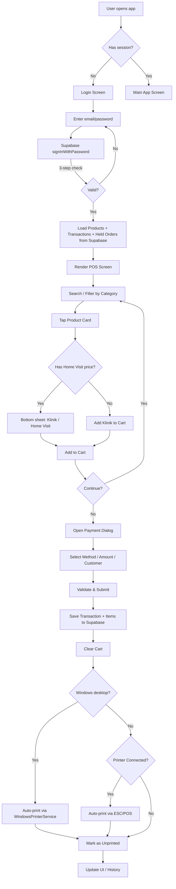

# 📂 PROJECT KNOWLEDGE BASE — DHBH POS

> **Generated:** 2026-07-27 · **Revision:** full source-tree review (verified against every file under `lib/`, plus `pubspec.yaml`, `main.dart`, `CHANGES.md`)
> **Agent:** Senior Software Architect & Technical Lead
> **Purpose:** Single source of truth for any developer or AI agent onboarding to this project.

---

## 1. 📋 Executive Summary

- **Project Name:** DHBH Pos (`dhbh_app`)
- **Core Purpose:** A Point of Sale (POS) system for a multi-branch healthcare/clinic business. Supports in-clinic and home-visit services, cashier management, thermal receipt printing, and Supabase-backed online-only operations with manual SQLite backup.
- **Target Audience:** Clinic cashiers (`kasir`), admins, and employees (`karyawan`) managing daily sales transactions, customer records, and closing reports.
- **Current Status:** **MVP / Active Development** — Core POS flow is functional. The v3.0 simplification removed the offline-first architecture; the app is now **online-only** (Supabase is the single source of truth, SQLite is used for manual backup only).
- **Per-branch pricing (v3.x feature):** ✅ **IMPLEMENTED** in Flutter (see §4a) — the previous "NOT implemented" note in older revisions is **stale**.
- **Windows desktop is the primary target** — full Windows printing support exists via the `printing` package (see §4c).
- **Android tablet support** — Optimized for 1280x800 resolution tablets with 2GB RAM (see §2.1 and §4d). Includes memory management, responsive UI scaling, and Android-specific configurations. **Bluetooth auto-connect** to paired devices (MAC: `66:12:3f:23:ef:92` and `66:22:0E:80:81:CC`) with print layout matching Windows format exactly.
- **Package ID:** `com.dhbh.dhbh_app`
- **Version:** `1.0.0+1` (Windows), `1.2.0+1` (Android branch with Bluetooth auto-connect)
- **Supabase Project:** `jiunlvlcwsntjbyybszd.supabase.co`

---

## 2. 🛠 Tech Stack & Environment

### Languages & Frameworks

| Layer | Technology | Version |
|---|---|---|
| Frontend | Flutter (Dart) | SDK constraint `^3.11.5` |
| State Management | Riverpod (`flutter_riverpod` + `riverpod_annotation`) | `^2.6.1` |
| Backend / BaaS | Supabase (`supabase_flutter`) | `^2.8.1` |
| Android Build | Gradle (Kotlin DSL) | AGP `8.11.1`, Kotlin `2.2.20` |
| iOS | Swift (SceneDelegate) | — |
| **Windows Desktop** | CMake + MSVC (**primary target**) | `flutter build windows` |
| **Android Tablet** | Optimized for 1280x800, 2GB RAM | `flutter build apk --release` |
| Linux / macOS / Web | Flutter desktop/web scaffolds present | — |

> The project contains full platform folders: `android/`, `ios/`, `windows/`, `linux/`, `macos/`, `web/`.
> **Android tablet optimizations** are in the `android-branch` with memory management, responsive UI scaling (800px breakpoint), and hardware acceleration.

### Database & ORM

| Component | Purpose | Version |
|---|---|---|
| Supabase (PostgreSQL) | **Primary operational database** — all reads/writes go here | `^2.8.1` |
| SQLite (`sqflite` + `sqflite_common_ffi`) | **Manual backup only** (`dhbh_backup.db`) — NOT used for POS operations. FFI factory is used on Windows/Linux where the native plugin is unavailable | `^2.4.1` / `^2.3.4` |

### Core Libraries (from `pubspec.yaml`)

| Library | Purpose | Version |
|---|---|---|
| `flutter_riverpod` + `riverpod_annotation` | State management (StateNotifier, Provider, StreamProvider) | `^2.6.1` |
| `supabase_flutter` | Supabase auth, database (REST), realtime | `^2.8.1` |
| `flutter_bluetooth_serial` | Bluetooth discovery, pairing, RFCOMM connection for thermal printer (**NOT Windows / web**) | `^0.4.0` |
| `printing` + `pdf` | **Windows printing** — renders receipts/closing reports as 80mm PDF and sends to the default system printer via `WindowsPrinterService` | `^5.14.2` / `^3.10.0` |
| `flutter_thermal_printer_windows` | **Windows Bluetooth thermal printing** — discovery, pairing, connection, ESC/POS receipts via `WindowsBluetoothPrinterService` | `^0.0.1` |
| `sqflite` + `sqflite_common_ffi` | SQLite for manual backup | `^2.4.1` / `^2.3.4` |
| `connectivity_plus` | Real-time network connectivity monitoring | `^6.1.1` |
| `intl` | Number/date formatting (Indonesian locale) | `^0.20.2` |
| `google_fonts` | Montserrat font family | `^6.2.1` |
| `uuid` | UUID v4 generation for local transaction IDs | `^4.5.1` |
| `shared_preferences` | Simple key-value storage | `^2.3.4` |
| `flutter_local_notifications` | Local push notifications | `^18.0.1` |
| `path_provider` / `path` | Filesystem paths (backup DB location) | `^2.1.5` / `^1.9.1` |
| `cupertino_icons` | iOS-style icons | `^1.0.8` |

Dev: `flutter_test` (SDK), `flutter_lints ^6.0.0`.

### Environment Variables / Secrets

> ⚠️ **DO NOT commit actual values.** Config is hardcoded in `lib/config/supabase_config.dart` — the anon key is safe for client-side usage.

| Variable | Description | Source File |
|---|---|---|
| `supabaseUrl` | `https://jiunlvlcwsntjbyybszd.supabase.co` | `lib/config/supabase_config.dart` |
| `supabaseAnonKey` | Supabase anon/public API key | `lib/config/supabase_config.dart` |

No `.env` file is used.

---

## 3. 📂 Directory Structure & Architecture

### Architecture Pattern: **Online-Only + Repository Pattern + Riverpod StateNotifier**

```
User Input → Screen (Widget) → Provider (StateNotifier) → Repository → Service → Supabase
```

- **Screens** are pure UI — they read state via `ref.watch()` and dispatch actions via `ref.read().notifier`.
- **Providers** (`PosProvider`) hold business logic and act as the single source of truth for `PosState`.
- **Repositories** abstract data access. Currently all call Supabase directly (no local cache).
- **Services** wrap the Supabase REST client, Bluetooth, and Windows/thermal printer hardware.
- **SQLite (`dhbh_backup.db`)** is used **only** for manual backup (Menu → Backup Data). It is NOT involved in any POS transaction flow.

### Directory Tree (verified against disk)

```
dhbh_app/  (i:\Projek\ANDROID)
├── android/                      # Android platform (Kotlin DSL)
├── ios/                          # iOS platform (Swift, Info.plist)
├── windows/                      # ★ PRIMARY TARGET — CMake + MSVC
├── linux/  ·  macos/  ·  web/    # Additional platform scaffolds
├── lib/                          # ★ MAIN APPLICATION CODE ★
│   ├── main.dart                 # Entry: global HTTP timeouts, Supabase init, Bluetooth init, _AppGate + offline banner, FlutterError.onError → log ke %TEMP%\dhbh_flutter_errors.log
│   ├── assets/                   # Static assets (logo-dhbh.png)
│   ├── config/
│   │   └── supabase_config.dart  # Supabase URL + anon key
│   ├── models/                   # Data models / DTOs
│   │   ├── product.dart          # Product + branchPrices + getEffectivePrice*()
│   │   ├── product_branch_price.dart # Per-branch price override
│   │   ├── cart_item.dart        # Cart item (product + qty + home visit flag + branchId)
│   │   ├── transaction.dart      # Transaction + status/payment/print enums + displayName extensions
│   │   ├── customer.dart         # Customer profile
│   │   ├── user.dart             # AppUser + UserRole enum (admin, kasir — NO karyawan)
│   │   └── held_order.dart       # Held/parked order
│   ├── providers/                # Riverpod state management
│   │   ├── pos_provider.dart     # ★ CENTRAL: PosProvider + PosState, supabaseClientProvider, posProvider
│   │   ├── connectivity_provider.dart # Network status stream (StreamProvider<bool>)
│   │   ├── bluetooth_provider.dart    # Bluetooth service/status/devices providers
│   │   ├── thermal_printer_provider.dart # ThermalPrinterService provider + legacy printerReadyProvider
│   │   ├── windows_printer_provider.dart # WindowsPrinterService provider + 10s polling ready stream
│   │   ├── windows_bluetooth_printer_provider.dart # WindowsBluetoothPrinterService + status/paired-devices streams
│   │   └── backup_provider.dart  # Backup state management
│   ├── repository/               # Data access layer (all → Supabase directly)
│   │   ├── auth_repository.dart      # login, getCurrentUser, logout, signUp
│   │   ├── product_repository.dart   # Product CRUD
│   │   ├── transaction_repository.dart # save (UUID local id), list, print status
│   │   ├── customer_repository.dart  # Customer CRUD
│   │   ├── held_order_repository.dart # get/save/retrieve/delete (delete → complete!)
│   │   ├── init_repository.dart      # [STALE PLACEHOLDER] — comment-only, not used
│   │   └── providers.dart            # Riverpod repository providers
│   ├── services/                 # External service integrations
│   │   ├── supabase_service.dart     # ★ ALL Supabase REST operations (products, transactions, customers, closing report, etc.)
│   │   ├── bluetooth_service.dart    # Bluetooth discovery, connect, send (singleton; safe no-op on Windows/web)
│   │   ├── thermal_printer_service.dart # ESC/POS receipt + closing report generation & printing (singleton)
│   │   ├── windows_bluetooth_printer_service.dart # ★ Bluetooth thermal on Windows via `flutter_thermal_printer_windows` (scan/pair/connect + ESC/POS Receipt)
│   │   └── windows_printer_service.dart # ★ PDF-based printing via `printing` package (singleton; Windows only)
│   ├── screens/                  # UI screens
│   │   ├── login_screen.dart     # Email/password login, two-column tablet layout + daftar "Akun Tersimpan" (SharedPreferences `saved_login_emails`; klik → autofill email → masukkan password)
│   │   ├── register_screen.dart  # User registration (admin only)
│   │   ├── main_app_screen.dart  # AppBar (logo/branch, today stats, BT status, user/logout) + 4-tab bottom nav
│   │   ├── pos_screen.dart       # ★ MAIN POS: search, category chips, product grid, cart panel, payment, hold
│   │   ├── history_screen.dart   # Transactions: search, sort, expand, refund, print again/copy
│   │   ├── customer_screen.dart  # Customer list, add/edit/delete, search (+ isPicker mode for payment dialog)
│   │   ├── menu_screen.dart      # Daily summary, closing report (date + modal awal + print), backup link, last 20 txns
│   │   └── backup_screen.dart    # Backup UI: info card, progress, success/error, start button
│   ├── widgets/                  # Reusable UI components
│   │   ├── product_card.dart     # Product grid card — shows EFFECTIVE clinic + home visit prices (branch-aware)
│   │   ├── cart_item_card.dart   # Cart item row with qty controls
│   │   ├── payment_dialog.dart   # Payment method, amount/change, customer (with picker; customer name REQUIRED)
│   │   ├── bluetooth_connection_dialog.dart # Device list, connect/disconnect
│   │   ├── bluetooth_status_widget.dart     # AppBar BT status indicator
│   │   ├── skeleton_widget.dart  # Loading skeleton animations
│   │   └── app_form_field.dart   # Reusable styled form field (AppFormField, AppActionButton)
│   ├── utils/
│   │   ├── app_theme.dart        # Colors (primaryGreen, darkBlue, etc.) + AppTypography
│   │   ├── network_utils.dart    # Connectivity check, DNS pre-flight, canReachSupabase()
│   │   ├── responsive_utils.dart # 800x1280 tablet-responsive sizing (padding, fonts, icons)
│   │   ├── wib_time.dart         # WIB (UTC+7) helper — toWib(), now(), toUtc(), offset
│   │   └── input_formatters.dart # ThousandsInputFormatter — auto titik ribuan utk field uang (Jumlah Dibayar, Modal Awal)
│   ├── audit/                    # [EMPTY] — reserved for future audit logs
│   ├── database/                 # [EMPTY] — leftover from removed offline architecture; safe to delete
│   └── backup/                   # Backup subsystem
│       ├── backup_database.dart  # SQLite schema + ops for dhbh_backup.db (6 tables)
│       ├── backup_repository.dart # Backup read/write (products, customers, transactions, categories, info)
│       └── backup_service.dart   # Orchestrates backup: fetch → save → verify
├── test/widget_test.dart         # Default Flutter smoke test only
├── pubspec.yaml                  # Flutter project config + dependencies
├── analysis_options.yaml         # Dart linter config (flutter_lints)
├── CHANGES.md                    # Migration history (karyawan role, RLS fixes, product_branch_prices)
├── PROJECT_CONTEXT.md            # THIS FILE
└── AGENTS.md                     # Agent guidance notes
```

---

## 4. 🧠 Core Logic & Data Flow (CRITICAL)

### Main Data Flow: Transaction Lifecycle



> **Note:** `_AppGate.checkSession()` **does NOT restore a session** — it always resets to logged-out state (`PosState()`), i.e. auto-logout on app restart is deliberate. Products/transactions/held orders are auto-loaded inside `PosProvider.login()` after a successful sign-in.

### Complex Business Logic

#### a. Effective Price Resolution (Per-Branch Pricing) — ✅ IMPLEMENTED

A product has a **default price** (`price_clinic`, `price_home_visit`) on the `products` table and optional **per-branch overrides** in `product_branch_prices`.

- `Product` model carries `List<ProductBranchPrice> branchPrices` and exposes `getEffectivePriceClinic(branchId)` / `getEffectivePriceHomeVisit(branchId)` (fallback to default price; home visit falls back to clinic price).
- `SupabaseService.fetchProducts()` **already LEFT JOINs** `product_branch_prices` (alias `branch_prices`) AND `product_categories` (alias `product_categories`):

```dart
// lib/services/supabase_service.dart — fetchProducts()
.select('''
  id, item_no, name, description, category,
  price_clinic, price_home_visit, image_url, is_active,
  product_categories!left(name),
  branch_prices:product_branch_prices!left(
    id, product_id, branch_id, price_clinic, price_home_visit
  )
''')
.order('item_no')
```

- **Consumers use effective prices:**
  - `CartItem.unitPrice` → `getEffectivePriceClinic/HomeVisit(branchId)` (branchId comes from `currentUser.branchId` via `PosProvider.addToCart`).
  - `ProductCard` renders `getEffectivePriceClinic(branchId)` / `getEffectivePriceHomeVisit(branchId)`.
  - `POSScreen._ProductCardWithPrice` shows the Klinik / Home Visit bottom sheet with effective prices.

> ⚠️ **Remaining gaps (not blockers):**
> 1. The query fetches branch prices for **ALL branches** (no server-side `.eq('branch_id', …)` filter) — the client filters by branch. Works correctly, just fetches extra rows.
> 2. `fetchProducts()` no longer filters `is_active` server-side — active/inactive filtering happens client-side in `PosProvider.filteredProducts()` (POS shows only active).
> 3. `description` is selected but not modeled.

#### b. Three-Step Authentication with DNS Pre-Flight

`SupabaseService.signIn()` runs a 3-step connectivity check to prevent socket hangs:

```
Step 1: NetworkUtils.isOnline()          → fail fast if offline (Indonesian error)
Step 2: NetworkUtils.checkDnsResolution() → InternetAddress.lookup(host), 3s timeout
Step 3: auth.signInWithPassword()         → 6s timeout
```

Additionally, `main.dart` installs a **global `HttpOverrides`** with a 5-second `connectionTimeout` on every `HttpClient`, and `Supabase.initialize()` is wrapped in a 10s timeout. `PosProvider.login()` adds a 12s overall timeout.

#### c. Receipt Printing — Two Parallel Paths

| Path | Platform | Mechanism |
|---|---|---|
| **Windows Bluetooth** (`WindowsBluetoothPrinterService`) | Windows desktop (preferred thermal path) | Uses `flutter_thermal_printer_windows`: scan → pair → connect over Bluetooth SPP, then prints structured `Receipt` (58mm, auto-cut) via ESC/POS. Preferred on Windows when a printer is connected. |
| **Windows PDF** (`WindowsPrinterService`) | Windows desktop (fallback) | Renders an 80mm × 297mm PDF via `pdf`, sends to the **default system printer** (no dialog) via `Printing.directPrintPdf`. Used when no Bluetooth thermal printer is connected. |
| **Bluetooth ESC/POS** (`ThermalPrinterService`) | Android / iOS / macOS / Linux | Raw byte stream over RFCOMM. ESC/POS commands: init (`0x1B 0x40`), alignment, bold, large font, paper cut (`0x1D 0x56 0x42 0x00`). |

- `BluetoothService.isSupported` is `!kIsWeb && !Platform.isWindows` — on Windows/web it becomes a safe no-op (initialized at startup with a 3s timeout).
- `WindowsBluetoothPrinterService.isSupported` is `!kIsWeb && Platform.isWindows` — the **preferred** thermal path on Windows (scan/pair/connect + ESC/POS `Receipt` via `flutter_thermal_printer_windows`).
- `WindowsPrinterService.isAvailable` is `!kIsWeb && Platform.isWindows`; it targets the `XP-58` printer by name when present (fallback to the default/first printer) via `Printing.directPrintPdf`.
- **Auto-print after payment** and **Print Again / Make a Copy** in History route through `PosProvider._tryAutoPrint()` / `printTransaction()`. On Windows they prefer a **connected Bluetooth thermal printer**, falling back to the Windows printer. Print status is persisted to `transactions.print_status` (`printed` / `failed`). `_tryAutoPrint` delegates to `printTransaction()` so auto-print also updates print status.
- ⚠️ **Windows Bluetooth SPP connections get aborted** by the printer/OS after a job (`0x80072745`). `WindowsBluetoothPrinterService._printWithReconnect` auto-reconnects (disconnect → 500ms → reconnect → retry). ESC/POS receipts use **ASCII `-` dividers** (the `─` U+2500 char prints garbage on some printers) and show `ID: #<order_no>` (the DB order number, not the local UUID).
- **Auto-connect printer saat login (2026-08-15)**: `WindowsBluetoothPrinterService.autoConnect()` dipanggil dari `PosProvider.login()` — memastikan Bluetooth Windows menyala (native WinRT Radio `isBluetoothEnabled`/`enableBluetooth` ditambahkan ke plugin vendor), lalu mencari printer dgn MAC default `66:12:3f:23:ef:92` di paired/scan (match via `allMatches` + `contains`, karena device-id berisi 2 MAC: adapter + printer), pair jika perlu, lalu connect.
- **Gate "no printer" (2026-08-15)**: tombol print di Menu (Ringkasan & Laporan) & `printTransaction()` kini cek `btPrinter.isConnected || WindowsPrinterService.isPrinterReady`; tanpa printer → snackbar "Tidak ada printer terhubung" / return false (bukan sukses palsu).
- **Error logging (2026-08-15)**: `main.dart` `FlutterError.onError` menulis exception Flutter + widget-tree ke `%TEMP%\dhbh_flutter_errors.log` (diagnosis overflow/layout).
- The Menu closing report / daily summary print uses the same preference (`WindowsBluetoothPrinterService` → `WindowsPrinterService` on Windows; `ThermalPrinterService` elsewhere).
- ⚠️ `PosProvider.printUnprintedTransactions()` still calls `ThermalPrinterService` unconditionally — it will fail on Windows. (No UI currently invokes it.)

#### d. Cart/Basket Logic (POS Screen)

- Items are added as **Klinik** (in-clinic) or **Home Visit** (home service).
- Duplicates are combined (same product + same type) by incrementing quantity.
- `cartTotal` / `cartItemCount` getters compute live totals.
- Held orders can be parked (`holdCurrentOrder`) and retrieved later (`retrieveHeldOrder`). **2026-08-15 — fully DB-backed + multi-customer**: `saveHeldOrder()` now returns the real DB id (`.select('id')`) so `completeHeldOrder()` marks the correct row `completed`; `fetchHeldOrders` only loads `hold_order_status='active'`; the hold dialog is dynamic (**`+ Tambah Pelanggan`** list, per-row remove) and stores multiple customer names in `held_orders.customers` (jsonb). On retrieve, names flow into the payment dialog via `PosState.pendingCustomerNames`.
- **Per-branch daily tracking (2026-08-15)**: badge "hari ini" (`PosProvider.todayTransactionCount`/`todayRevenue` + `MainAppScreen`) difilter per `currentUser.branchId`; ringkasan harian Menu dibaca dari tabel `daily_summaries` per cabang (setelah memanggil RPC `generate_daily_summary` via `fetchDailySummary({branchId})` — fungsi kini **`SECURITY DEFINER`** + zero-fill semua cabang, jadi selalu ada baris di tabel dan RPC app bisa menulis); closing report (`getProductsSold`/`getPaymentBreakdown`/`getTransactionCounts`) juga difilter per cabang. `fetchTransactions()` kini SELECT `branch_id` & set `Transaction.branchId`. Header "Ringkasan Harian" di Menu menampilkan nama cabang. Catatan: filter builder query harus di-reassign (`q = q.eq(...)`) agar `branch_id` benar-benar diterapkan.
- Payment dialog: cash shows amount-paid + change; non-cash methods auto-set amountPaid = total. **At least one customer name is mandatory** (form validator) and can be picked from the customer directory (picker mode). **2026-08-15 — dynamic multi-customer & multi-terapis**: the dialog now has a **`+ Tambah Pelanggan`** button (a list of customer-name fields, each required, with per-row remove) and a **`+ Tambah Terapis`** button (multi-select chips from a searchable picker filtered to role `karyawan` + current cashier's branch via `SupabaseService.fetchTherapists(branchId)`), plus a **Note** textarea (e.g. `Tips: Rp 50.000`). `customers` (jsonb array of names), `terapis` (jsonb array of `{id,name}`) and `notes` are persisted on `transactions`. **2026-08-15 — Diskon**: a **Diskon** section (ChoiceChip **Persen (%) / Nominal (Rp)** + value field, thousands auto-format) computes `discountAmount` (clamped 0..total), shows **Total Setelah Diskon**, validates cash `paid < grandTotal`, and persists `discount` (INT) — `total_amount` = grand total after discount; `subtotal = total_amount + discount` is shown on receipts when `discount > 0`.
- **2026-08-15 — Branch isolation**: `fetchTransactions({branchId})` & `fetchAllTransactions({branchId})` filter `.eq('branch_id', ...)`; the provider loads transactions with `currentUser.branchId` and the Menu transaction list passes `branchId` — a branch cannot see another branch's transactions. (backup_service keeps an unfiltered `fetchTransactions()` for the full backup.)

#### e. Refunds

`HistoryScreen` → expand transaction → **Refund** → `SupabaseService.processRefund()` inserts a `refunds` row and flips `transactions.status` to `refunded`.

### Enums and State Machines

```dart
enum TransactionStatus { completed, pending, cancelled, refunded }   // DB stores enum name
enum PaymentMethod { cash, transfer, qris }                          // DB stores lowercase: cash/transfer/qris
enum PrintStatus { printed, unprinted, failed, pending }
enum UserRole { admin, kasir }                                       // NO karyawan in Dart
```

> **DB nuance:** `payment_method` is persisted as the enum `.name` (`cash`, `transfer`, `qris`) and stored in the `transactions.payment_method` `text` column, guarded by CHECK constraint allowing `cash`/`transfer`/`qris`. Legacy values `debit`/`credit`/`e_wallet` were migrated on 2026-08-14 (`debit`/`credit` → `transfer`, `e_wallet` → `qris`).

---

## 4d. 📱 Android Tablet Optimizations (android-branch)

**Target Device:** Android tablets with 2GB RAM and 1280x800 screen resolution.

### Key Optimizations

| Area | Implementation | Benefit |
|---|---|---|
| **UI Scaling** | Responsive breakpoint at 800px, increased font/icon/button sizes | Better touch targets and readability on tablet screens |
| **Memory Management** | Memory pressure handlers, `largeHeap` flag, image cache clearing | Prevents OOM crashes on 2GB RAM devices |
| **Layout Optimization** | Tablet-specific layout with reduced padding, dense mode | Maximum content display on 1280x800 resolution |
| **Android Config** | Hardware acceleration, `resizeableActivity`, leanback support | Multi-window support and better performance |
| **Resource Limiting** | Density restrictions (hdpi), limited resource variants | Reduced APK size and memory footprint |
| **Performance** | Limited image cache, simplified skeleton animations | Smoother UI on low-RAM devices |
| **Bluetooth Auto-Connect** | Auto-connect to MAC `66:12:3f:23:ef:92` and `66:22:0E:80:81:CC` on startup | Seamless printer connection without manual pairing |
| **Print Layout** | ESC/POS receipt format matching Windows print layout exactly | Consistent receipt appearance across platforms |

### Files Modified

- `lib/utils/responsive_utils.dart` — Adjusted breakpoints and sizing for 1280x800
- `android/app/src/main/AndroidManifest.xml` — Added `largeHeap`, hardware acceleration, leanback
- `android/app/build.gradle.kts` — Resource density restrictions
- `lib/main.dart` — Memory pressure handlers
- `lib/screens/login_screen.dart`, `lib/screens/pos_screen.dart` — Tablet-specific layouts
- `lib/services/bluetooth_service.dart` — Bluetooth auto-connect logic for specific MAC addresses
- `lib/services/thermal_printer_service.dart` — Print layout matching Windows format

### Build Command

```bash
flutter build apk --release
```

Output: `build/app/outputs/flutter-apk/app-release.apk`

---

## 5. 🗄️ Database Schema & State Management

> **Note:** This section is derived from **static code analysis** of the Flutter/Dart codebase (query patterns in `lib/services/supabase_service.dart`, `CHANGES.md`, models). The schema below is inferred; verify against the live Supabase project when changing DB-level behavior.

### Tables & Relations

| Table | Key Columns | Relations | Description |
|---|---|---|---|
| **`products`** | `id` (BIGSERIAL PK), `item_no`, `name`, `description`, `price_clinic` (INT), `price_home_visit` (INT?), `category`, `image_url`, `is_active` | 1:N → `transaction_items`, 1:N → `product_branch_prices`, N:1 → `product_categories` | Master product catalog |
| **`product_branch_prices`** | `id` (BIGSERIAL PK), `product_id` (FK → products), `branch_id` (FK → branches), `price_clinic` (INT?), `price_home_visit` (INT?) | N:1 → products, N:1 → branches | Per-branch price overrides (UNIQUE on product_id + branch_id) |
| **`product_categories`** | `id`, `name` | 1:N → products (via `category` column / FK) | Product category reference |
| **`transactions`** | `id` (BIGSERIAL PK), `order_no` (INT), `cashier_id` (FK → user_profiles), `branch_id` (FK → branches?), `customer_name`, **`customers` (JSONB array of names — 2026-08-15)**, `terapis_id` (FK → user_profiles), `terapis_name`, **`terapis` (JSONB array of {id,name} — 2026-08-15)**, `notes`, `total_amount`, **`discount` (INT, default 0 — 2026-08-15; total_amount = grand total setelah diskon)**, `amount_paid`, `change_amount`, `payment_method` (text: `cash`/`transfer`/`qris`), `status` (text), `print_status` (VARCHAR), `created_at` | 1:N → `transaction_items`, 1:N → `refunds` | Completed/refunded sales; customers & terapis can be multiple (JSONB); optional discount |
| **`transaction_items`** | `id`, `transaction_id` (FK → transactions), `product_id`, `product_name`, `quantity`, `unit_price`, `total_price`, `is_home_visit`, `notes`, `created_at` | N:1 → transactions | Line items for each transaction (unit_price snapshots effective price at sale time) |
| **`held_orders`** | `id` (BIGSERIAL PK), `cashier_id` (FK → user_profiles), `items` (JSONB), `notes`, `customer_name`, **`customers` (JSONB array of names — 2026-08-15)**, `hold_order_status` (VARCHAR), `created_at` | — | Parked/held orders (items + multiple customers stored as JSONB) |
| **`customers`** | `id` (BIGSERIAL PK), `name`, `phone`, `address`, `total_visits`, `total_spent`, `created_at`, `updated_at` | — | Customer directory |
| **`user_profiles`** | `id` (UUID PK, FK → auth.users), `username`, `full_name`, `role_id` (FK → user_roles), `branch_id` (FK → branches?), `is_active` | N:1 → user_roles, N:1 → branches | Extended user data; app maps role_id 1 → `admin`, everything else → `kasir` |
| **`user_roles`** | `id` (PK), `name` (VARCHAR) | 1:N → user_profiles | Roles: `admin` (1), `kasir` (2), `karyawan` (3) — **karyawan (3) is collapsed to `kasir` in the Flutter app** |
| **`branches`** | `id` (PK), `name` | 1:N → user_profiles, 1:N → transactions | Clinic branches |
| **`activity_logs`** | `id`, `user_id`, `action`, `details` (JSONB), `created_at` | — | User activity audit trail (only `login` is logged today) |
| **`cashier_shifts`** | `id` (PK), `cashier_id`, `branch_id`, `modal_awal`, `waktu_buka`, `waktu_tutup` | — | Cashier shift tracking — methods exist in service (`saveShift`, `updateShiftWaktuTutup`) but **no UI calls them**; closing report uses a local `_modalAwal` input instead |
| **`refunds`** | `id`, `transaction_id` (FK → transactions), `cashier_id`, `reason`, `refund_amount`, `refund_method`, `created_at` | N:1 → transactions | Refund records |
| **`daily_summaries`** | `branch_id`, `date` (UNIQUE branch_id+date), `total_transactions`, `total_revenue`, `total_cash`, `total_transfer`, `total_qris`, `total_refunds` | N:1 → branches | Per-branch daily sales. **2026-08-15**: kini dibaca app (ringkasan harian per cabang), diisi on-demand via RPC `generate_daily_summary` (kolom `total_transfer` ditambahkan) |
| **`product_variants`** | [Inferred from RLS fix] | — | Not queried by the app |
| **`split_payments`** | [Inferred from RLS fix] | — | Not queried by the app |
| **`inventory_movements`** | [Inferred from RLS fix] | — | Not queried by the app |

### RLS Policies

Based on `CHANGES.md` (migration history). Verify in the Supabase dashboard:

| Table | Policy | Effect |
|---|---|---|
| `products` | Authenticated users can SELECT | Products visible to all logged-in users |
| `product_branch_prices` | SELECT for `{public}`; INSERT/UPDATE/DELETE for `admin` role | Readable by all, writable by admin |
| `user_roles` | SELECT for `{public}` | Role list public |
| `customers` | SELECT for `{public}` | Customer list public |
| `user_profiles` | SELECT for `{public}`; UPDATE for own record + admin | Users edit own profile; admins edit any |
| `transactions` | SELECT/INSERT for authenticated users | Cashiers can read/write transactions |
| `daily_summaries`, `product_categories`, `product_variants`, `split_payments`, `inventory_movements` | SELECT for `{public}` | Read-only visibility |

### State Management Architecture

| State | Mechanism | Description |
|---|---|---|
| **App State** | `PosProvider` (StateNotifier) | Central state: user, products, cart, transactions, held orders, search/filter |
| **Connectivity** | `connectivityProvider` (StreamProvider\<bool\>) | Real-time online/offline status (drives the red offline banner in `_AppGate`) |
| **Bluetooth** | `bluetoothStatusProvider`, `bluetoothDevicesProvider`, `connectedBluetoothDeviceProvider` (StreamProviders) | Printer connection status, device list, connected device |
| **Windows Printer** | `windowsPrinterReadyProvider` (StreamProvider) | Default-printer availability, re-checked every 10s |
| **Backup** | `backupProvider` (StateNotifier) | Backup progress, success/error state |
| **Printer (legacy)** | `printerReadyProvider` (StateProvider) | Unused flag — legacy |

### Critical Data Types

```dart
// ★ CENTRAL STATE
class PosState {
  final AppUser? currentUser;
  final List<Product> products;
  final List<CartItem> cartItems;
  final List<Transaction> transactions;
  final List<HeldOrder> heldOrders;
  final String? pendingCustomerName;
  final String searchQuery;
  final String selectedCategory;      // '' = all
  final String menuSelectedCategory;  // '' = all
  final bool isLoading;
}

// ★ KEY ENUMS
enum TransactionStatus { completed, pending, cancelled, refunded }
enum PaymentMethod { cash, transfer, qris }
enum PrintStatus { printed, unprinted, failed, pending }
enum UserRole { admin, kasir }

// ★ KEY MODELS
class Product {
  int id; int? itemNo; String name;
  int priceClinic; int? priceHomeVisit;
  bool isActive; String category; String? imageUrl;
  List<ProductBranchPrice> branchPrices;
  int getEffectivePriceClinic(int branchId);   // branch override ?? default
  int getEffectivePriceHomeVisit(int branchId);// branch override ?? (home ?? clinic)
}

class CartItem {
  Product product; int quantity; String? notes;
  bool isHomeVisit; int? branchId;
  int get unitPrice;   // Effective price (branch-aware)
  int get totalPrice;  // unitPrice * quantity
}

class Transaction {
  String id; int? orderNo; String cashierId;
  List<CartItem> items; int totalAmount;
  int discount;  // diskon (Rp); totalAmount = GRAND TOTAL setelah diskon
  int amountPaid; int change;
  PaymentMethod paymentMethod; TransactionStatus status;
  PrintStatus printStatus; DateTime createdAt;
  String cashierName;
  List<String> customerNames;  // multiple customers (JSONB `customers`)
  List<String> terapisIds;     // multiple terapis ids (JSONB `terapis`)
  List<String> terapisNames;   // multiple terapis names
  // Backward-compat getters (joined): customerName / terapisId / terapisName
  int? branchId; String? branchName;
  int get totalItems;
  int get subtotal;  // = totalAmount + discount
}
// ⚠️ When loaded from DB (fetchTransactions), id == order_no as String.
// ✅ 2026-08-15: multi-customer & multi-terapis (JSONB) + discount.

class AppUser {
  String id; String username; String name;
  UserRole role; int? branchId; String? branchName;
  bool get isAdmin;
}
```

---

## 6. 🔌 APIs & External Integrations

### Internal Endpoints (Supabase REST API)

All data operations go through Supabase's auto-generated REST API at `https://jiunlvlcwsntjbyybszd.supabase.co/rest/v1/` via the `supabase_flutter` client.

| Operation | Supabase Table / Call | Method in `SupabaseService` |
|---|---|---|
| **Auth: Sign Up** | `auth.signUp()` + `user_profiles` insert (role_id 1=admin, 2=other) | `signUp()` |
| **Auth: Sign In** | `auth.signInWithPassword()` + profile fetch (3-step check) | `signIn()` |
| **Auth: Get Session** | `auth.currentSession` | `getCurrentUser()` |
| **Auth: Sign Out** | `auth.signOut()` | `signOut()` |
| **Products: List** | `products` + LEFT JOIN `product_branch_prices` + `product_categories` | `fetchProducts()` |
| **Products: Add/Update/Delete** | `products` INSERT/UPDATE/DELETE | `addProduct()`, `updateProduct()`, `deleteProduct()` |
| **Transactions: List** | `transactions` + embedded `transaction_items` (DESC by created_at) — parses `customers` (jsonb[]) & `terapis` (jsonb[{id,name}]) | `fetchTransactions()` |
| **Transactions: Save** | `transactions` INSERT (next order_no) + `transaction_items` batch INSERT — writes `customers` jsonb[] + `terapis` jsonb[{id,name}] (plus legacy `customer_name`/`terapis_name` join) | `saveTransaction()` |
| **Therapists: List** | `user_profiles` SELECT (role_id=3, branch_id=current, is_active) | `fetchTherapists()` |
| **Terapis by Date** | distinct terapis used on a date (per branch) from `terapis` jsonb + legacy `terapis_name` — for daily summary & closing report receipts | `getTerapisForDate(date, {branchId})` |
| **Print Status** | `transactions` UPDATE `print_status` (single / bulk by order_no) | `updatePrintStatus()`, `updateMultiplePrintStatus()` |
| **Held Orders** | `held_orders` SELECT (by cashier, active) / INSERT / UPDATE → completed | `fetchHeldOrders()`, `saveHeldOrder()`, `completeHeldOrder()` |
| **Customers** | `customers` SELECT / INSERT / UPDATE / DELETE | `fetchCustomers()`, `addCustomer()`, `updateCustomer()`, `deleteCustomer()` |
| **Branches** | `branches` SELECT | `fetchBranches()` |
| **Categories** | `product_categories` SELECT | `fetchCategories()` |
| **Refunds** | `refunds` INSERT + `transactions` UPDATE → refunded | `processRefund()` |
| **Daily Summary** | `daily_summaries` (per `branch_id` + WIB `date`) — di-refresh via RPC `generate_daily_summary`, fallback agregasi `transactions` per cabang | `fetchDailySummary({branchId})` |
| **Closing Report** | `transaction_items` + `transactions` (by date, **per branch**) — **aggregated client-side** | `getProductsSold(date, {branchId})`, `getPaymentBreakdown(date, {branchId})`, `getTransactionCounts(date, {branchId})` |
| **All Transactions (admin)** | `transactions` SELECT limit 50 + user name lookup | `fetchAllTransactions()` |
| **Activity Logs** | `activity_logs` SELECT limit 50 + user name lookup | `fetchActivityLogs()` |
| **Log Activity** | `activity_logs` INSERT | `logActivity()` |
| **Cashier Shift** | `cashier_shifts` INSERT / UPDATE | `saveShift()`, `updateShiftWaktuTutup()` |
| **Next Order No** | `transactions` SELECT MAX order_no | `_getNextOrderNo()` |

### Third-Party Services

| Service | Purpose | Integration Point |
|---|---|---|
| **Supabase** | Auth, Database, REST API | `supabase_flutter` package |
| **Windows Printing** | PDF → default system printer (no dialog) | `printing` + `pdf` packages |
| **Bluetooth (non-Windows)** | Thermal printer RFCOMM connection | `flutter_bluetooth_serial` package |
| **Bluetooth (Windows)** | Thermal printer discovery, pairing, connection, ESC/POS | `flutter_thermal_printer_windows` package |
| **Google Fonts** | Montserrat font | `google_fonts` package |

### No External Webhooks

No webhooks, payment gateways, or third-party APIs are currently integrated. All payments are manual (cash, debit, credit, QRIS, e-wallet) tracked as enums in the transaction record.

### ⏰ Timezone Convention (WIB — Indonesia Western Time, UTC+07:00)

- Supabase stores **UTC** for all `created_at`/`waktu_tutup` columns (DB default `now()`); the app never sends `created_at` on INSERT.
- **Query boundaries must be sent as UTC** (with `Z`). Dart `DateTime.toIso8601String()` on a naive *local* `DateTime` produces a string **without** `Z`, which Postgres interprets as UTC → off by 7 hours (a WIB midnight `00:00` becomes `00:00 UTC` = `07:00 WIB`, so "today" queries returned **0 rows** and closing reports were empty). Fix (2026-08-15): all daily/closing boundaries in `fetchDailySummary()`, `getProductsSold()`, `getPaymentBreakdown()`, `getTransactionCounts()` call `.toUtc()` first (`startUtc`/`endUtc`).
- **Stored timestamps parsed from the DB are UTC** — convert to WIB before displaying/comparing: `WibTime.toWib(DateTime)` (i.e. `dt.toUtc().add(Duration(hours:7))`). Applied to receipts (all 3 printer services), `HistoryScreen`, `MenuScreen` transaction list, and the "today" badge (`PosProvider.todayTransactionCount`/`todayRevenue` + `MainAppScreen` AppBar).
- Helper: `lib/utils/wib_time.dart` (`WibTime.offset = 7h`, `toWib()`, `now()`, `toUtc()`).
- Closing-report `waktu_buka`/`waktu_tutup` are built client-side from WIB-local `DateTime` — no conversion needed there.

---

## 7. ⚠️ Known Issues & Constraints (verified against current source)

### Bugs / Technical Debt

| # | Issue | Severity | File(s) | Status |
|---|---|---|---|---|
| 1 | **`fetchProducts()` fetches branch prices for ALL branches** (no server-side `.eq('branch_id', …)` filter) and **does not filter `is_active` server-side**. Client-side filtering makes it correct, but it transfers extra rows. | Low | `supabase_service.dart` | Polish |
| 2 | **Stale "SQLite" comments in `pos_provider.dart`** — `addProduct`/`updateProduct`/`deleteProduct` log "SQLite now has N products" / "Reload from local SQLite" but actually reload from Supabase. Cosmetic only. | Low | `pos_provider.dart` | Cosmetic |
| 3 | **`init_repository.dart` is a stale placeholder** — comment-only file, no longer used. | Low | `repository/init_repository.dart` | Cleanup desired |
| 4 | **No offline transaction queue** — if Supabase is unreachable during a sale, the sale is lost. App shows an offline banner but does not queue transactions. | **MEDIUM** | `supabase_service.dart`, `pos_provider.dart` | Known limitation |
| 5 | **No session persistence** — `checkSession()` always resets state to empty (auto-logout on app restart); `getCurrentUser()` exists but is never used for restore. | Medium | `pos_provider.dart` | By design |
| 6 | **`HeldOrderRepository.deleteHeldOrder()` calls `completeHeldOrder()`** — "delete" flips `hold_order_status` to `completed` instead of deleting (by design; same for retrieve). **Fixed 2026-08-15**: `saveHeldOrder()` stores the real DB id so the update targets the correct row (previously a fake local id → row never completed → reappeared after restart). | Low | `held_order_repository.dart` | By design (semantics documented) |
| 7 | **`printUnprintedTransactions()` uses `ThermalPrinterService` unconditionally** — will fail on Windows (no Bluetooth). No UI currently triggers it. | Low | `pos_provider.dart` | Unused on Windows |
| 8 | **`cashier_shifts` is not wired to any UI** — `saveShift()`/`updateShiftWaktuTutup()` exist in the service but nothing calls them; the closing report hardcodes shift hours (07:00–21:00) and uses a local `Modal Awal` text field. | Medium | `menu_screen.dart`, `supabase_service.dart` | Gap |
| 9 | **`karyawan` role (id=3) is collapsed to `kasir`** in Dart — `roleId == 1 ? 'admin' : 'kasir'`; `UserRole` enum has no `karyawan`. | Medium | `models/user.dart`, `supabase_service.dart` | Role gap |
| 10 | **Customer name is effectively mandatory** — `PaymentDialog` form validator blocks checkout without it, though `transactions.customer_name` is nullable. | Low | `payment_dialog.dart` | UX choice |
| 11 | **Mixed-language strings** — some UI text in Indonesian, some English ("Print Again", "Make a Copy", "Refund", snackbars). | Low | Multiple screens | Consistency |
| 12 | **Loading states inconsistent** — POS/History use skeletons, Customer uses `CircularProgressIndicator`, some actions have none. | Low | Multiple screens | UX polish |
| 13 | ~~`e_wallet` ↔ `eWallet` mapping~~ — **Resolved 2026-08-14**: `PaymentMethod` simplified to `cash`/`transfer`/`qris`, DB values match enum `.name` exactly (no remapping). | Info | `supabase_service.dart`, `models/transaction.dart` | ✅ Fixed |
| 14 | **`Transaction.id` is `order_no` as String when loaded from DB** — used as the display id and for refunds (`int.tryParse`); new local transactions use a UUID until saved. | Info | `supabase_service.dart`, `history_screen.dart` | Documented |

### Architectural Limitations

- **Online-only architecture**: The app cannot process sales without internet. All data (products, transactions, customers) is read/written directly to Supabase. SQLite (`dhbh_backup.db`) is for manual backup only.
- **Single database tenant**: All branches share one Supabase project; isolation via `branch_id` FK + RLS.
- **No real-time updates**: No Supabase Realtime subscriptions. Data is fetched on login, tab tap, or pull-to-refresh.
- **Daily summary**: kini bersumber dari tabel `daily_summaries` (SQL aggregation per branch via `generate_daily_summary`), dengan fallback agregasi client-side. Closing report masih agregasi client-side (per branch).
- **Print status**: Persisted to Supabase but re-fetched fresh on each app start; "unprinted" reprint flow is effectively unused.
- **`lib/database/` is an empty leftover** from the removed offline architecture — safe to delete.

---

## 8. 🚀 Instructions for the Next Agent (The Handover)

### Immediate Tasks (Priority Order)

1. **🟡 MEDIUM — Add Offline Transaction Queue**
   - If Supabase is unreachable during checkout, queue the sale locally and sync later. This is the most critical missing feature for production readiness.

2. **🟡 MEDIUM — Wire up / Remove Cashier Shifts**
   - Either surface `cashier_shifts` (save shift on open, set `waktu_tutup` on close, link `modal_awal`) or remove the dead service methods. Closing report currently hardcodes shift 07:00–21:00 and takes `modal_awal` from a local text field.

3. **🟡 MEDIUM — Support `karyawan` role in Flutter**
   - `user_roles` has id 3 = `karyawan` but the app collapses any non-admin role to `kasir`. Decide whether `karyawan` needs a distinct UX (read-only? no cart?) and extend `UserRole`.

4. **🟢 LOW — Clean Up Stale Code**
   - Remove `init_repository.dart` placeholder and the empty `lib/database/` folder.
   - Fix the stale "SQLite reload" comments in `pos_provider.dart`.
   - Fix `HeldOrderRepository.deleteHeldOrder()` to actually delete (or clearly rename semantics).
   - Make `printUnprintedTransactions()` route through `WindowsPrinterService` when available, or delete it.

5. **🟢 LOW — Per-Branch Pricing Query Tuning**
   - Optional: filter `fetchProducts()` by current branch id server-side (`product_branch_prices.branch_id`) and add back `.eq('is_active', true)` — or keep client-side filtering if data volume is small.

6. **🟢 LOW — Localization & UX Polish**
   - Standardize user-facing strings to Indonesian (Bahasa); unify loading states (skeleton vs spinner); verify pull-to-refresh on all data screens.

### Coding Standards & Conventions

#### MUST FOLLOW:
- **Architecture**: Screens → Providers (StateNotifier) → Repositories → Services → Supabase. Never call Supabase directly from screens (exceptions today: `history_screen.dart` and `customer_screen.dart` read `supabaseServiceProvider` directly — prefer moving to repositories when touched).
- **State Management**: Use Riverpod exclusively. `ref.watch()` for reactive reads, `ref.read().notifier` for actions.
- **Naming**: Files `snake_case.dart`; classes `PascalCase`; methods/variables `camelCase`; enum values `lowerCamelCase` (Dart convention).
- **Logging**: `debugPrint('[Tag] message')` — tags in use: `[DHBH Provider]`, `[DHBH Supabase]`, `[Bluetooth]`, `[Network]`, `[Printer]`, `[WinPrinter]`, `[Repo:Auth]`, `[Repo:Product]`, `[Repo:Transaction]`, `[Repo:Customer]`, `[Repo:HeldOrder]`, `[Backup]`, `[BackupRepo]`, `[BackupDB]`, `[HTTP]`, `[Connectivity]`, `[POS]`, `[Menu]`.
- **Error Handling**: Always wrap async operations in try-catch with logging. Use custom timeouts (5s global HTTP, 3s DNS, 6s auth/query, 12s login) for all network calls.
- **Responsive Design**: Call `ResponsiveUtils.init(context)` at the start of every `build()` method; use responsive constants.
- **Printing**: Prefer `WindowsPrinterService` on Windows; Bluetooth ESC/POS elsewhere. Check `WindowsPrinterService.isAvailable` before printing.

#### STRICTLY FORBIDDEN:
- ❌ Never store secrets/keys in the codebase beyond the Supabase anon key (safe for client-side usage).
- ❌ Never use `setState()` for app-wide state — use Riverpod providers.
- ❌ Never import `dart:io` in platform-agnostic code (prefer conditional imports / `kIsWeb` guards).
- ❌ Never add a new dependency without updating `pubspec.yaml` and running `flutter pub get`.
- ❌ Never modify `AndroidManifest.xml` without updating the iOS `Info.plist` counterpart.
- ❌ Never bypass the repository layer to call `SupabaseService` directly from a screen (existing exceptions above should be migrated).
- ❌ Never use `print()` — always use `debugPrint()`.

### How to Run

#### Prerequisites
- Flutter SDK with Dart `^3.11.5`.
- **Windows desktop build** requires: Visual Studio (C++ workload) + **Windows Developer Mode enabled** (Settings → Privacy & security → For developers → Developer Mode) for plugin symlink support.
- Android Studio / Xcode for Android/iOS builds (optional).
- A physical Android device or emulator for Bluetooth features.

#### Setup & Run — Windows (primary target)
```bash
# 1. Get dependencies
cd dhbh_app
flutter pub get

# 2. Run on Windows desktop
flutter run -d windows

# 3. Build Windows executable (debug/release)
flutter build windows --debug
flutter build windows --release

# 4. Android build (still supported)
flutter build apk --release

# 5. Run tests
flutter test
```

> ✅ **Windows printing is supported** (primary path). Receipts and the closing report are rendered as an 80mm PDF by `WindowsPrinterService` (`lib/services/windows_printer_service.dart`) and sent to the **default system printer** via the `printing` package — no dialog. The app auto-prints after payment on Windows (`pos_provider.dart`), and the Menu screen prints the closing report / daily summary to the Windows printer. `windowsPrinterReadyProvider` re-checks printer availability every 10s.
>
> ⚠️ **Bluetooth thermal printing works on Android/iOS/macOS/Linux — NOT Windows or web.** `BluetoothService.isSupported` is `false` on Windows/web and the service becomes a safe no-op.

#### Environment
- **Supabase**: configured in `lib/config/supabase_config.dart`; live at `jiunlvlcwsntjbyybszd.supabase.co`.
- **No .env file needed** — Supabase config is hardcoded (anon key only).
- **Login**: Supabase auth; register via `RegisterScreen` or the Supabase dashboard.

#### Debugging Tips
- **Watch debug logs**: `flutter logs` or `adb logcat | grep DHBH`
- **Supabase queries**: logged with `[DHBH Supabase]` prefix.
- **Network**: DNS pre-flight logs with `[Network]` prefix; global HTTP timeouts with `[HTTP]`.
- **Bluetooth**: `[Bluetooth]` prefix; **Windows printing**: `[WinPrinter]` prefix.
- **Print failures**: `[Printer]` / `[WinPrinter]` prefixes.

---

> **End of Document.** This knowledge base was regenerated from a full read of the current source tree (`lib/` in full, `pubspec.yaml`, `main.dart`, `CHANGES.md`, platform folders). Anything not found in the code is marked `[Inferred]` or `[NOT FOUND]`. Update this document when significant architectural changes are made.
